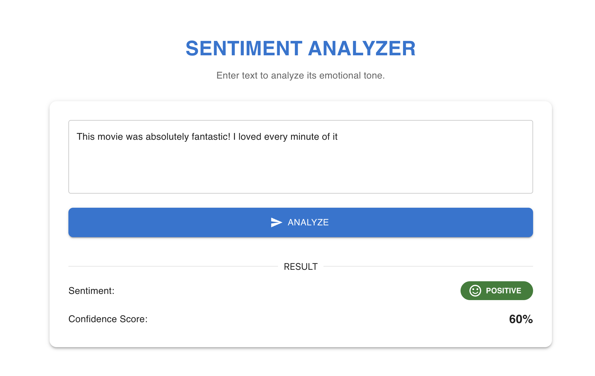

# Sentiment Analyzer (FastAPI & React MUI)

Ovaj projekt predstavlja rješenje tehničkog zadatka za poziciju Backend/AI Developer pripravnika u **Smart Code**. Sustav omogućuje korisnicima analizu emocionalnog tona teksta na engleskom jeziku putem modernog web sučelja.

## Značajke
- **REST API**: Izgrađen pomoću FastAPI okvira, osigurava visoke performanse i automatsku dokumentaciju.
- **Sentiment Analysis**: Precizna kategorizacija teksta u tri kategorije: *Positive*, *Negative* i *Neutral*.
- **Moderni UI**: Responzivno sučelje izgrađeno pomoću React-a i **Material UI (MUI)** komponenti.
- **Validacija podataka**: Implementirana provjera ulaznih podataka (vratit će 400 Bad Request ako je polje prazno).
- **Interaktivna dokumentacija**: Swagger UI dostupan odmah nakon pokretanja backenda.

## Tehnološki stog
- **Backend**: Python 3.9+, FastAPI, TextBlob, Uvicorn.
- **Frontend**: React.js, Material UI (MUI), Fetch API.
- **Alati**: Git, npm.

## Struktura projekta
```text
.
├── app/                 # FastAPI Backend
│   ├── main.py          # Glavna aplikacija i CORS postavke
│   ├── analyzer.py      # Logika za NLP analizu (TextBlob)
│   └── models.py        # Pydantic modeli za validaciju
├── frontend/            # React Frontend (MUI)
│   ├── src/
│   │   └── App.js       # Glavna React komponenta
│   └── package.json
├── requirements.txt     # Python ovisnosti
└── README.md            # Dokumentacija projekta
```

## Instalacija i pokretanje
1. Backend (FastAPI)
Pozicionirajte se u korijenski direktorij:
```
pip install -r requirements.txt
python3 -m textblob.download_corpora

python3 -m uvicorn app.main:app --reload
```
*API dokumentacija (Swagger): http://127.0.0.1:8000/docs*

2. Frontend (React)
U novom terminalu uđite u mapu frontend:
```
cd frontend
npm install
npm start
```
*Aplikacija se otvara na: http://localhost:3000*

## Odabir ML modela
Za potrebe ovog zadatka odabran je **TextBlob** (zasnovan na NLTK-u).

### Zašto TextBlob?

* **Efikasnost**: Izuzetno je brz i ne zahtijeva velike računalne resurse (CPU/RAM), što ga čini idealnim za mikroservise.
* **Jednostavnost**: Nudi pouzdane rezultate za analizu sentimenta općeg tipa bez potrebe za kompleksnim treniranjem modela.
* **Interpretabilnost**: Polaritet (*Polarity*) jasno pokazuje smjer emocije, što olakšava prikaz "Confidence score-a" krajnjem korisniku.

## 🧪 Primjeri za testiranje
* **Positive**: "This movie was absolutely fantastic! I loved it."
* **Negative**: "The service was terrible and I am very disappointed."
* **Neutral**: "The package arrived on Tuesday as scheduled."



